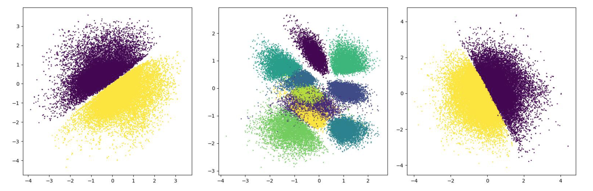
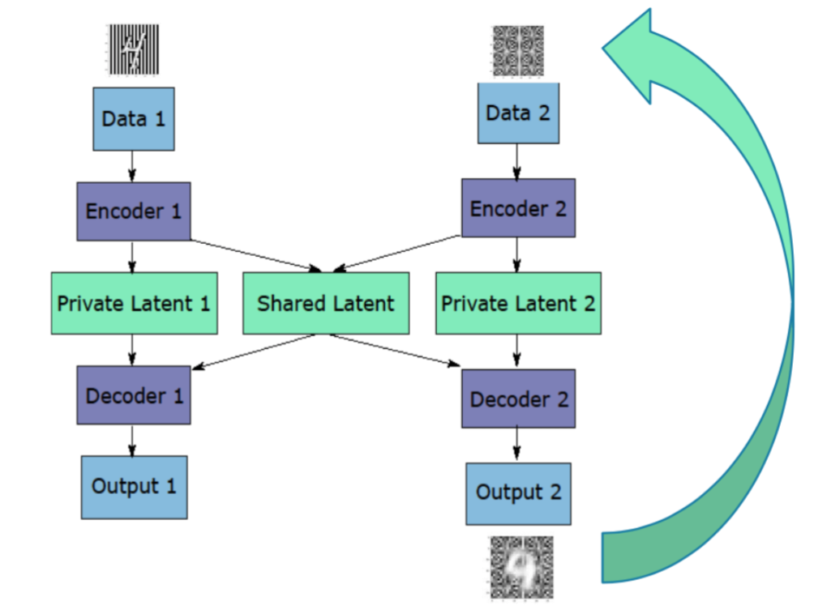
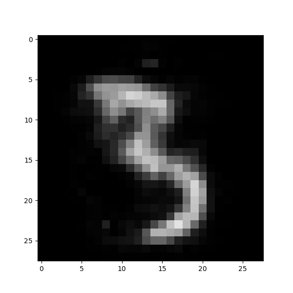
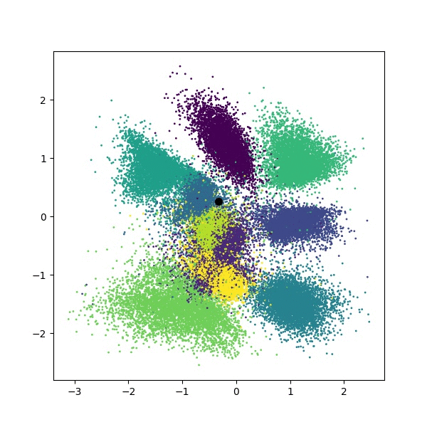
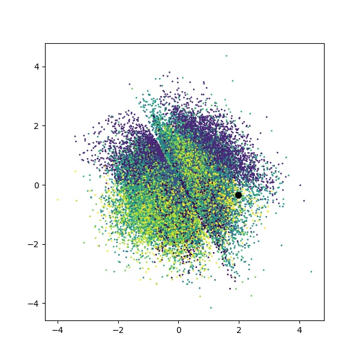

Various Experiments with Variational Autoencoders
===================================================

## Description

The main purpose of this repository is to provide a well-organised *playground*
for experimentation with Variational Autoencoders (VAE). It is built with an intent
to remain modular and flexible to host equally well various crazy architectures and
to reproducibly launch, manage, evaluate and visualise experiments.

This repository builds on top of my implementation of the Adversarial Variational Bayes
(AVB) model [1] that you can find [here](https://github.com/gdikov/adversarial-variational-bayes).

## Requirements

The code is writted in Python 3.5.2 and makes heavy use of Keras 2.0.6 with a TensorFlow 1.2.1 as backend.
Please refer to the `requirements.txt` for working package versions.
Very likely the code will also run using a Python 2.7 interpreter but is not tested recently.

## Models
Currently, the repository contains the implementation of vanilla Gaussian VAE [2], AVB
as well as siamese (also called _conjoint_) variants of the two.
While the first two models are thoroughly described in the cited papers, I couldn't find
any reference for the Siamese Autoencoders (SAE), though there surely is at least one.

The motivation for SAE is that multiple datasets can share common structures or features
and that these could be stored in a _shared_ latent space. Additionally each autoencoder in
tha SAE model has its own private latent space, where non-shared data structures are encoded.
This configuration, together with some pre-processing (sorting) allows for data-to-data translation
where common elements are preserved. For examples see the _Experiments_ section below.
The network architecture is graphically depicted in `doc/architectures/conjoint_model.png`.

## Experiments

#### Synthetic datasets
Each of the models have been evaluated on a corresponding synthetic dataset as a proof of concept.
For the Gaussian VAE and AVB models these are the experiments described in [1].
For the SAE, the dataset has been augmented to incorporate shared and private parts accordingly.
See the code and the comments there for more details.

#### MNIST
A common benchmark in the framework is the MNIST dataset. For the SAE model an augmented variation
is used, where the digit background is substituted with some pattern (e.g. stripy, mosaic, checkerboard etc.)
This is a sample of the latent space of the AVB SAE model on two datasets, each containing two
different backgrounds (horizontal and vertical for the left and mosaic and blank for the right):

###### Iterative background transfer
Using the SAE one can change the background of an image by plugging in a source and target images.
The source should be the desired number and target -- the background, which the target autoencoder has seen
in the form of augmented MNIST digits. The diagram below shows the concept:

Although this MCMC-style technique could yield the desired result, often it fails,
producing digit transitions as shown below:

Pixel space |  Shared latent space  | Private latent space
:----------:|:---------------------:|:---------------------:
|    | 

Note that this private latent space is plotted with the colour map from the digit labels, only to show that
the learned private space contains little information about the digit itself (because of the mixed clusters),
but rather the background (because of the well pronounced class separation in the yellow-purple plot above).

## Acknowledgements
Many thanks to Maximilian Karl for the fruitful discussions and the invaluable advice!

## References
[1]: 
Lars Mescheder, Sebastian Nowozin, and Andreas Geiger.
"Adversarial variational bayes: Unifying variational autoencoders and generative adversarial networks." 
arXiv preprint arXiv:1701.04722 (2017).

[2]:
Diederik P Kingma, Max Welling.
"Auto-Encoding Variational Bayes"
Proceedings of the 2nd International Conference on Learning Representations (2014)